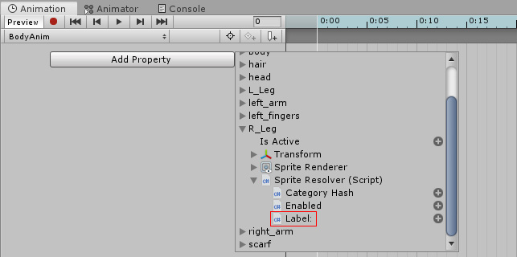
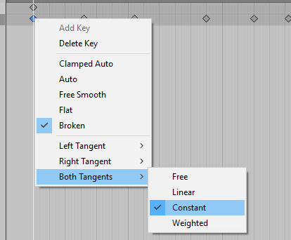

# Frame-by-frame animation

By using [Sprite Swap](SpriteSwapIntro.md), you can create frame-by-frame style animations by swapping to different Sprites on each frame at runtime. This is useful for simple animations, such as to show a character blinking. It is recommended that you first [change the keyframe tangent](#change-the-keyframe-tangent) before continuing with the workflow below:

1. In your character Prefab’s __Sprite Library Asset__ (which can be automatically or [manually created](SSManual.md)), add a new __Category__. Add the Sprite for each frame of your animation to this Category, and give them each a unique __Label__ name.

2. Select your character Prefab and drag it into the Scene view.

3. Open the [Animation](https://docs.unity3d.com/Manual/AnimationOverview.html) window, and select your character Prefab. Then select the __Add Property__ button, and select the [Sprite Resolver component](SRComponent.md)’s __Label__ property. 

   

   

4. Change the __Label__ property at each keyframe in the Animation window in the order they should appear for your animation. This simulates a frame-by-frame animation style.

## Change the Keyframe Tangent

When animating with the Category and Label value of the Sprite Resolver in the Animation window, it is important to change the keyframe’s tangent in the Animation window to __Constant__.

This is because the Sprite Resolver component uses the defined string hash value to locate the desired Sprite. If the values between keyframe’s are interpolated, the Sprite Resolver will not be able to resolve and render the correct Sprite.